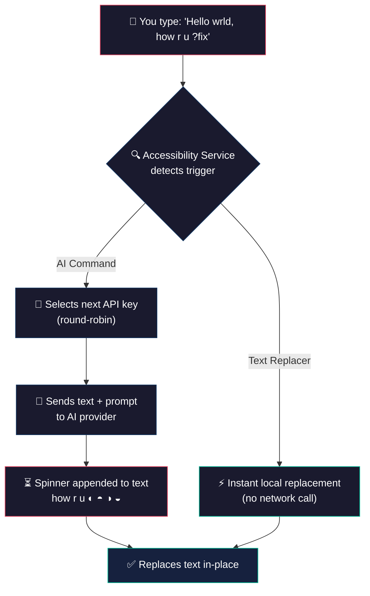

<div align="center">

<br>


<br>

# Sage

### System-wide AI text assistant for Android — powered by Gemini, Groq, and any OpenAI-compatible endpoint

*Forked from [Musheer360/SwiftSlate](https://github.com/Musheer360/Sage)*

Type a trigger like **`?fix`** at the end of any text, in any app, and watch it get replaced — instantly.

<br>

[](#-getting-started)
[](#%EF%B8%8F-tech-stack)
[](#-supported-ai-providers)
[](LICENSE)

<br>

</div>

> [!NOTE]
> **Sage works in most apps** — WhatsApp, Gmail, Twitter/X, Messages, Notes, and more. No copy-pasting. No app switching. Just type and go. Some apps with custom input fields may not be supported ([see limitations](#%EF%B8%8F-known-limitations)).

> [!TIP]
> **Looking for the Windows version?** Check out [**Sage Desktop**](https://github.com/Musheer360/Sage-Desktop) — same concept, works system-wide on Windows 10/11.

<br>

## 📋 Table of Contents

- [Quick Demo](#-quick-demo)
- [Features](#-features)
- [Built-in Commands](#-built-in-commands)
- [Text Replacer Commands](#-text-replacer-commands)
- [Supported AI Providers](#-supported-ai-providers)
- [Getting Started](#-getting-started)
- [How It Works](#%EF%B8%8F-how-it-works)
- [Text-Selection Menu](#%EF%B8%8F-text-selection-menu)
- [Custom Commands](#-custom-commands)
- [API Key Management](#-api-key-management)
- [Backup & Restore](#-backup--restore)
- [App Screens](#-app-screens)
- [Screenshots](#-screenshots)
- [Localization](#-localization)
- [Privacy & Security](#-privacy--security)
- [Tech Stack](#%EF%B8%8F-tech-stack)
- [Architecture](#-architecture)
- [Building from Source](#-building-from-source)
- [Trying a Pull Request](#-trying-a-pull-request-without-touching-your-install)
- [Contributing](#-contributing)
- [Sponsors](#-sponsors)
- [Support the Project](#-support-the-project)
- [License](#-license)
- [Star History](#-star-history)

<br>

## ⚡ Quick Demo

```
📝  You type       →  "i dont no whats hapening ?fix"
⏳  You see        →  "i dont no whats hapening ◐"  (spinner animates)
✅  Result         →  "I don't know what's happening."
```

```
📝  You type       →  "hey can u send me that file ?formal"
⏳  You see        →  "hey can u send me that file ◐"  (spinner animates)
✅  Result         →  "Could you please share the file at your earliest convenience?"
```

```
📝  You type       →  "Hello, how are you? ?translate:es"
⏳  You see        →  "Hello, how are you? ◐"  (spinner animates)
✅  Result         →  "Hola, ¿cómo estás?"
```

<br>

## ✨ Features

<table>
<tr>
<td width="50%">

### 🌐 Works Almost Everywhere
Integrates at the system level via Android's Accessibility Service. Works in **most apps** — messaging, email, social media, notes, browsers, and more. Some apps with custom input fields may not be supported ([see limitations](#%EF%B8%8F-known-limitations)).

### ✂️ Text-Selection Menu
Select any text, tap **Sage** in the Copy/Share popup, and pick a command — no accessibility permission required. Works in any app that offers Android's text-selection menu, including apps the accessibility flow can't reach.

### ⚡ Instant Inline Replacement
Type, trigger, done. The AI response replaces your text directly in the same field — no copy-pasting, no app switching. While processing, an animated spinner appends to your text (e.g., `how r u ◐`) so you always see progress. Text replacer commands execute instantly.

### 🔑 Multi-Key Rotation
Add multiple API keys for automatic round-robin rotation. If one key hits a rate limit, Sage seamlessly switches to the next.

### 🌙 AMOLED Dark Theme
Pure black (`#000000`) Material 3 interface designed for OLED screens — saves battery and looks stunning. Light theme also included.

</td>
<td width="50%">

### 🤖 Multi-Provider AI
Ships with Google Gemini, Groq, or connect **any OpenAI-compatible endpoint** — cloud providers, or **local LLMs** like [Ollama](https://ollama.com), [LM Studio](https://lmstudio.ai), and others running on your network.

### 🛠️ Two Command Types
**AI commands** send text to your provider for intelligent transformation. **Text replacer commands** run entirely offline for instant local text manipulation — no API key needed.

### 🔒 Encrypted Key Storage
API keys are encrypted with **AES-256-GCM** using the Android Keystore before being written to disk — they never leave your device unencrypted.

### 🌍 Localized in 40 Languages
The UI ships in 40 languages and automatically follows your device's language, falling back to English when a translation isn't available.

### 🚫 Zero Analytics
No telemetry, no tracking, no crash reporting — text is sent only to your configured AI provider, never anywhere else.

</td>
</tr>
</table>

<br>

## 🧩 Built-in Commands

Sage ships with **9 AI-powered commands**, dynamic translation, and **5 built-in local commands** — ready to use out of the box. The AI commands are seeded as editable entries, so you can reword or delete any of them:

| Trigger | Action | Example |
|:--------|:-------|:--------|
| **`?fix`** | Fix grammar, spelling & punctuation | `i dont no whats hapening` → `I don't know what's happening.` |
| **`?improve`** | Improve clarity and readability | `The thing is not working good` → `The feature isn't functioning properly.` |
| **`?shorten`** | Shorten while keeping meaning | `I wanted to let you know that I will not be able to attend the meeting tomorrow` → `I can't attend tomorrow's meeting.` |
| **`?expand`** | Expand with more detail | `Meeting postponed` → `The meeting has been postponed to a later date. We will share the updated schedule soon.` |
| **`?formal`** | Rewrite in professional tone | `hey can u send me that file` → `Could you please share the file at your earliest convenience?` |
| **`?casual`** | Rewrite in friendly tone | `Please confirm your attendance at the event` → `Hey, you coming to the event? Let me know!` |
| **`?emoji`** | Add relevant emojis | `I love this new feature` → `I love this new feature! 🎉❤️✨` |
| **`?human`** | Humanize AI-generated text | `I hope this email finds you well. I wanted to delve into...` → `Hope you're doing well. I wanted to dig into...` |
| **`?reply`** | Generate a contextual reply | `Do you want to grab lunch tomorrow?` → `Sure, I'd love to! What time works for you?` |
| **`?undo`** | Restore text from before the last replacement | Reverts to your original text before AI modified it |
| **`?translate:XX`** | Translate to any language | `Hello, how are you?` **`?translate:es`** → `Hola, ¿cómo estás?` |

<details>
<summary>🌍 <strong>Supported language codes for translation</strong></summary>

<br>

Use any standard language code with `?translate:XX`:

| Code | Language | Code | Language | Code | Language |
|:-----|:---------|:-----|:---------|:-----|:---------|
| `es` | Spanish | `fr` | French | `de` | German |
| `ja` | Japanese | `ko` | Korean | `zh` | Chinese |
| `hi` | Hindi | `ar` | Arabic | `pt` | Portuguese |
| `it` | Italian | `ru` | Russian | `nl` | Dutch |
| `tr` | Turkish | `pl` | Polish | `sv` | Swedish |

…and many more. Any ISO 639 language code works — the AI model handles it.

</details>

### 📋 Clipboard Commands

Sage also includes **4 clipboard commands** that work entirely offline, using the real Android system clipboard:

| Trigger | Action | Example |
|:--------|:-------|:--------|
| **`?copy`** | Copy preceding text to the clipboard | `Hello world?copy` → copies "Hello world" |
| **`?cut`** | Cut preceding text (copy + delete) | `Hello world?cut` → cuts "Hello world" |
| **`?paste`** | Paste after existing text | Type `?paste` → appends the clipboard contents |
| **`?replace`** | Replace all text with clipboard content | Type `?replace` → replaces field content with the clipboard contents |

> [!NOTE]
> `?paste` and `?replace` work with anything you've copied, in any app. Since Android 10, an accessibility service can't *read* the clipboard (only the focused app and the active keyboard can), so Sage doesn't try — it asks the text field itself to paste, which the app performs under its own focus. If a field ignores that request, Sage falls back to the last text you copied with `?copy` or `?cut`.

<br>

## 🛠️ Text Replacer Commands

Beyond AI, you can create **text replacer commands** that run **entirely offline** — no API key, no network, instant execution:

| Use Case | Trigger | Replacement | Result |
|:---------|:--------|:------------|:-------|
| **Signatures** | `?sig` | `— John Doe, CEO` | Appends your signature |
| **Canned responses** | `?ty` | `Thank you for reaching out! I'll get back to you shortly.` | Instant reply template |
| **Snippets** | `?addr` | `123 Main St, Springfield, IL 62701` | Quick address insertion |
| **Shortcuts** | `?email` | `contact@example.com` | Fast email insertion |

> [!TIP]
> Text replacer commands execute instantly with zero latency — no spinner, no network call. Create them in the **Commands** tab by selecting the **"Text Replacer"** type.

<br>

## 🤖 Supported AI Providers

| Provider | Models | Notes |
|:---------|:-------|:------|
| **Google Gemini** (default) | `gemini-3.5-flash-lite` (default), `gemini-3.6-flash` | Free tier available at [aistudio.google.com](https://aistudio.google.com) |
| **Groq** | `openai/gpt-oss-120b` (default), `qwen/qwen3.6-27b` | Free tier at [console.groq.com](https://console.groq.com/keys) |
| **Custom (OpenAI-compatible)** | Any model your endpoint supports | Works with Ollama, LM Studio, vLLM, any `/v1/chat/completions` endpoint |

> [!TIP]
> For local LLMs, set the endpoint to your machine's local address (e.g., `http://localhost:11434/v1` for Ollama). HTTP is allowed for `localhost`, `127.0.0.1`, and `10.0.2.2`.

<br>

## 🚀 Getting Started

### Prerequisites

| Requirement | Details |
|:------------|:--------|
| **Android Device** | Android 6.0+ (API 23 or higher) |
| **API Key** | Free Gemini key at [aistudio.google.com](https://aistudio.google.com), or a key from Groq / any OpenAI-compatible provider. *Not required for text replacer commands.* |

### Installation

> [!TIP]
> The APK is only ~1.4 MB — lightweight with zero external dependencies for networking or JSON.

**Option 1 — F-Droid:**

[](https://f-droid.org/en/packages/com.mossgreen.sage/)

**Option 2 — GitHub Releases:**

**1.** Download the latest APK from the [**Releases**](https://github.com/Musheer360/Sage/releases/latest) page

**2.** Install the APK on your device (allow installation from unknown sources if prompted)

**3.** Open Sage and follow the setup below

### Setup in 3 Steps

<table>
<tr>
<td width="33%" align="center">

**Step 1**

🔑 **Add API Key**

Open the **Keys** tab, enter your API key. It's validated before saving. Add multiple keys for rotation.

</td>
<td width="33%" align="center">

**Step 2**

♿ **Enable Service**

On the **Dashboard**, tap **"Enable"** → find **"Sage Assistant"** in Accessibility Settings → toggle it on.

</td>
<td width="33%" align="center">

**Step 3**

✍️ **Start Typing!**

Open any app, type your text, add a trigger like `?fix` at the end, and watch the magic happen.

</td>
</tr>
</table>

<br>

## ⚙️ How It Works



<details>
<summary>🔧 <strong>Technical deep-dive</strong></summary>

<br>

1. **Event Listening** — Sage registers an Accessibility Service that listens for `TYPE_VIEW_TEXT_CHANGED` events across all apps (ignoring its own UI and password fields)
2. **Fast Exit Optimization** — For performance, it first checks if the last character of typed text matches any known trigger's last character before doing a full scan
3. **Longest Match** — When a potential match is found, it searches for the longest matching trigger at the end of the text
4. **Command Routing** — Text replacer commands execute immediately on-device. AI commands proceed to the API call path
5. **API Call** — The text + prompt is sent to the configured AI provider using the next available key in the round-robin rotation
6. **Inline Spinner** — While waiting for the AI response, the trigger is replaced with an animated spinner appended to your original text (e.g., `how r u ◐`) to show progress
7. **Watchdog Timer** — A 120-second safety timer auto-cancels stuck processing jobs to prevent the service from becoming unresponsive
8. **Text Replacement** — The response replaces the original text using `ACTION_SET_TEXT`
9. **Fallback Strategy** — If `ACTION_SET_TEXT` fails (some apps don't support it), Sage falls back to a clipboard-based select-all + paste approach
10. **Post-Replace Verification** — A delayed check ensures the IME didn't clobber the replacement, re-applying if needed
11. **Bounded Responses** — API responses are capped at 1 MB to prevent memory issues from malformed responses

</details>

<br>

## ✂️ Text-Selection Menu

Every app that offers Android's text-selection popup (the one with Copy, Cut, Share) can show **Sage** as an option, whether or not the accessibility service is enabled:

1. Select text in any app
2. Tap **Sage** in the popup
3. Pick a command
4. Get the result back with **Insert** (replaces the selection in-place, when the field allows it) or **Copy**

It runs the same commands, requests, and errors as typing a trigger — just through a one-shot dialog that closes as soon as it's done, with no new permissions. Built-in clipboard commands (`?copy`, `?cut`, `?paste`, `?replace`, `?undo`) aren't available here since they need the live text field the accessibility flow has access to.

<br>

## 🎨 Custom Commands

Create, edit, and manage your own commands in the **Commands** tab.

### Two Types of Custom Commands

| Type | How It Works | Needs API Key? | Latency |
|:-----|:-------------|:---------------|:--------|
| **AI** | Sends text to your AI provider with your custom prompt | Yes | ~1–3 seconds |
| **Text Replacer** | Replaces the trigger with a fixed string, entirely offline | No | Instant |

### Example AI Command Ideas

| Trigger | Prompt | Use Case |
|:--------|:-------|:---------|
| `?eli5` | `Explain this like I'm five years old.` | Simplify complex topics |
| `?bullet` | `Convert this text into bullet points.` | Quick formatting |
| `?headline` | `Rewrite this as a catchy headline.` | Social media posts |
| `?code` | `Convert this description into pseudocode.` | Developer shorthand |
| `?tldr` | `Summarize this text in one sentence.` | Quick summaries |

> [!TIP]
> Just describe the transformation you want — Sage's system instruction automatically ensures the AI returns only the transformed text without extra commentary.

<br>

## 🔑 API Key Management

Sage supports multiple API keys with intelligent rotation:

| Feature | Details |
|:--------|:--------|
| **Round-Robin Rotation** | Keys are used in turn to spread usage evenly across all configured keys |
| **Rate-Limit Handling** | If a key gets rate-limited (HTTP 429), Sage tracks the cooldown and skips it automatically |
| **Invalid Key Detection** | Keys returning 401/403 errors are marked invalid and excluded from rotation |
| **Encrypted Storage** | All keys encrypted with AES-256-GCM via Android Keystore before being saved locally |
| **Live Validation** | Keys are validated against the provider's API before being saved |

> [!TIP]
> Adding **2–3 API keys from different accounts** helps avoid rate limits during heavy use. On the free tier, all keys under the same account share a single quota — so rotation only helps with keys from separate accounts.

<br>

## 💾 Backup & Restore

Export and import your custom commands as JSON files — useful for migrating to a new device or sharing command sets.

- **Export** — Saves all custom commands to a `.json` file via Android's file picker
- **Import** — Loads commands from a `.json` file (validates format, trigger prefix, and size limits before importing)

Find both options in the **Settings** tab under **Backup & Restore**.

> [!NOTE]
> Imported commands must use the same trigger prefix currently configured in the app. API keys are **not** included in backups for security.

<br>

## 🖥️ App Screens

Sage has **four screens** accessible via the bottom navigation bar:

<table>
<tr>
<td width="25%" valign="top">

#### 📊 Dashboard
- Service status indicator (green/red)
- Enable/disable toggle
- API key count
- Quick-start guide
- Version info & update check

</td>
<td width="25%" valign="top">

#### 🔑 Keys
- Add new keys (validated live)
- Delete existing keys
- AES-256-GCM encryption
- Multi-key management
- Direct link to get API keys

</td>
<td width="25%" valign="top">

#### 📝 Commands
- 5 built-in commands (read-only)
- 9 AI commands, editable like your own
- Add custom commands (AI or Text Replacer)
- Edit existing custom commands
- Delete custom commands

</td>
<td width="25%" valign="top">

#### ⚙️ Settings
- **Provider selection** (Gemini, Groq, Custom)
- **Model picker** per provider
- Custom endpoint URL & model
- Trigger prefix customization
- Backup & restore commands

</td>
</tr>
</table>

<br>

## 📸 Screenshots

<div align="center">

**Dark Mode**

<table>
<tr>
<td></td>
<td></td>
</tr>
<tr>
<td></td>
<td></td>
</tr>
</table>

**Light Mode**

<table>
<tr>
<td></td>
<td></td>
</tr>
<tr>
<td></td>
<td></td>
</tr>
</table>

</div>

<br>

## 🌍 Localization

Sage's UI is available in **40 languages**:

| | | | |
|:--|:--|:--|:--|
| 🇺🇸 English `en` | 🇸🇦 Arabic `ar` | 🇧🇬 Bulgarian `bg` | 🇪🇸 Catalan `ca` |
| 🇨🇿 Czech `cs` | 🇩🇰 Danish `da` | 🇩🇪 German `de` | 🇬🇷 Greek `el` |
| 🇪🇸 Spanish `es` | 🇪🇪 Estonian `et` | 🇮🇷 Persian `fa` | 🇫🇮 Finnish `fi` |
| 🇫🇷 French `fr` | 🇮🇳 Hindi `hi` | 🇭🇷 Croatian `hr` | 🇭🇺 Hungarian `hu` |
| 🇮🇩 Indonesian `in` | 🇮🇹 Italian `it` | 🇮🇱 Hebrew `iw` | 🇯🇵 Japanese `ja` |
| 🇰🇷 Korean `ko` | 🇱🇹 Lithuanian `lt` | 🇱🇻 Latvian `lv` | 🇲🇾 Malay `ms` |
| 🇳🇴 Norwegian `nb` | 🇳🇱 Dutch `nl` | 🇵🇱 Polish `pl` | 🇵🇹 Portuguese `pt` |
| 🇧🇷 Portuguese (BR) `pt-rBR` | 🇷🇴 Romanian `ro` | 🇷🇺 Russian `ru` | 🇸🇰 Slovak `sk` |
| 🇸🇮 Slovenian `sl` | 🇷🇸 Serbian `sr` | 🇹🇭 Thai `th` | 🇹🇷 Turkish `tr` |
| 🇺🇦 Ukrainian `uk` | 🇻🇳 Vietnamese `vi` | 🇨🇳 Chinese `zh` | 🇨🇳 Chinese (Simplified) `zh-rCN` |

The app automatically uses your device's language, and falls back to English otherwise.

Adding a translation is a single directory: drop `values-<locale>/strings.xml` into `app/src/main/res/` and it ships automatically — the build derives the shipped locale list from that folder, so nothing else needs editing. Contributions welcome.

<br>

## 🔒 Privacy & Security

> [!NOTE]
> Sage is built with privacy as a **core architectural principle**, not an afterthought.

| | Concern | How Sage Handles It |
|:--|:--------|:------------------------|
| 👁️ | **Text Monitoring** | Only processes text when a trigger command is detected at the end. All other typing is completely ignored. Password fields are always skipped. |
| 📡 | **Data Transmission** | Text is sent **only** to the configured AI provider (Google Gemini, Groq, or your custom endpoint). No other servers are ever contacted. Text replacer commands never leave your device. |
| 🔐 | **Key Storage** | API keys are encrypted with AES-256-GCM using the Android Keystore system. Encryption failures throw rather than falling back to plaintext. |
| 📊 | **Analytics** | **None.** Zero telemetry, zero tracking, zero crash reporting. |
| 📖 | **Open Source** | The entire codebase is open for inspection under the MIT License. |
| 🔑 | **Permissions** | Requires Accessibility Service and notification permissions only. |
| 💾 | **Backups** | API keys and settings are excluded from Android cloud backups and device transfers. |

<br>

## 🏗️ Tech Stack

<table>
<tr><td><strong>Language</strong></td><td>Kotlin 2.4</td></tr>
<tr><td><strong>UI</strong></td><td>Jetpack Compose · Material 3</td></tr>
<tr><td><strong>Async</strong></td><td>Kotlin Coroutines</td></tr>
<tr><td><strong>HTTP</strong></td><td><code>HttpURLConnection</code> (zero external dependencies)</td></tr>
<tr><td><strong>JSON</strong></td><td><code>org.json</code> (Android built-in)</td></tr>
<tr><td><strong>Storage</strong></td><td>SharedPreferences (encrypted via Android Keystore)</td></tr>
<tr><td><strong>Background Work</strong></td><td>WorkManager (daily update checks)</td></tr>
<tr><td><strong>Core Service</strong></td><td>Android Accessibility Service</td></tr>
<tr><td><strong>Build System</strong></td><td>Gradle with Kotlin DSL</td></tr>
<tr><td><strong>Java Target</strong></td><td>JDK 17</td></tr>
<tr><td><strong>Min SDK</strong></td><td>API 23 (Android 6.0)</td></tr>
<tr><td><strong>Target SDK</strong></td><td>API 36</td></tr>
</table>

> **Zero third-party dependencies** for networking or JSON parsing — Sage uses only Android's built-in APIs.

<br>

## 🏛️ Architecture

```
com.mossgreen.sage/
├── service/
│   ├── AssistantService.kt      # Core accessibility service — event listening, trigger
│   │                            # detection, text replacement, undo, inline spinner
│   ├── CommandRunner.kt         # Shared request policy (key rotation, rate-limit backoff,
│   │                            # error mapping) used by both the accessibility service and
│   │                            # the text-selection popup
│   ├── ErrorMessages.kt         # Maps raw provider/network errors to localized strings
│   └── OverlayToast.kt          # TYPE_ACCESSIBILITY_OVERLAY toast with enter/exit animation
├── api/
│   ├── GeminiClient.kt          # Google Gemini API client
│   ├── OpenAICompatibleClient.kt # Unified client for Groq + any OpenAI-compatible endpoint
│   └── ApiClientUtils.kt        # Shared utilities — response parsing, error classification,
│                                # refusal detection, secret redaction, system prompt
├── manager/
│   ├── KeyManager.kt            # Key storage, round-robin rotation, rate-limit tracking,
│   │                            # invalid-key benching with expiry
│   ├── KeyCipher.kt             # AES-256-GCM via AndroidKeyStore, behind an interface so
│   │                            # KeyManager is testable without the keystore
│   ├── CommandManager.kt        # Command CRUD, trigger matching (longest-match),
│   │                            # prefix migration, import/export
│   └── StatsManager.kt          # Usage counters — monthly total, per-command, last 7 days
├── provider/
│   └── ProviderConfig.kt        # Per-provider config (transport, endpoint, model key,
│                                # reasoning/thinking params) + registry
├── model/
│   ├── Command.kt               # Command data class (AI or Text Replacer)
│   ├── GeminiModels.kt          # Gemini model catalog + per-model thinking level
│   ├── GroqModels.kt            # Groq model catalog + per-model reasoning params
│   ├── PrefKeys.kt              # SharedPreferences key constants
│   └── ProviderType.kt          # Provider constants (gemini, groq, custom)
├── ui/
│   ├── DashboardScreen.kt       # Service status, key count, usage stats, 7-day chart
│   ├── KeysScreen.kt            # API key management with live validation
│   ├── CommandsScreen.kt        # Command list, add/edit/delete with collapsible form
│   ├── SettingsScreen.kt        # Provider, model, temperature, prefix, backup/restore
│   ├── processtext/             # ACTION_PROCESS_TEXT entry point (the text-selection menu)
│   │   ├── ProcessTextActivity.kt      # One-shot dialog activity, owns the bottom sheet
│   │   ├── ProcessTextViewModel.kt     # Picker -> loading -> result state machine
│   │   ├── ProcessTextInput.kt         # Parses/validates the system-provided selection
│   │   └── ProcessTextReplacement.kt   # Correlates a finished popup result with the next
│   │                                    # accessibility event to auto-replace in-place
│   ├── components/              # Reusable UI components (cards, text fields, dividers,
│   │                            # the app's own bottom sheet and toast)
│   └── theme/Theme.kt           # AMOLED dark + light Material 3 color schemes
├── MainActivity.kt              # AnimatedContent tab navigation (4 tabs)
├── SageViewModel.kt       # Shared ViewModel exposing managers + prefs
├── SageApp.kt             # Application class — SharedPreferences pre-warming,
│                                # WorkManager update check scheduling
└── worker/
    └── UpdateCheckWorker.kt     # Daily background check for new GitHub releases
```

<br>

## 🔨 Building from Source

### Prerequisites

- [**Android Studio**](https://developer.android.com/studio) (latest stable)
- **JDK 17+**
- **Android SDK** with API level 36

### Build

```bash
# Clone the repository
git clone https://github.com/Musheer360/Sage.git
cd Sage

# Build debug APK
./gradlew assembleDebug

# Output: app/build/outputs/apk/debug/app-debug.apk
```

### Install on device

```bash
adb install app/build/outputs/apk/debug/app-debug.apk
```

<details>
<summary>📦 <strong>Signed release build</strong></summary>

<br>

```bash
export KEYSTORE_FILE=/path/to/your/keystore.jks
export KEYSTORE_PASSWORD=your_keystore_password
export KEY_ALIAS=your_key_alias
export KEY_PASSWORD=your_key_password

./gradlew assembleRelease
```

</details>

<br>

## 🧪 Trying a Pull Request Without Touching Your Install

Every pull request builds a **preview APK** you can install side by side with a stable release.

It ships as a separate app — applicationId `com.mossgreen.sage.preview`, shown on your launcher as **Sage Preview** — so installing it never replaces your stable build and never touches its API keys, commands, stats or accessibility setting. Both appear as separate entries under Settings → Accessibility, and you can enable whichever you want to test.

1. Open the pull request's **Checks** tab and pick the latest **Build & Release** run
2. Download the `Sage-preview-prNNN` artifact from the **Artifacts** section
3. Unzip and install the APK, then enable **Sage Preview** in accessibility settings
4. Uninstall it when you're done — your stable install is untouched throughout

Preview builds are shrunk and non-debuggable like release builds, but signed with a debug key, so they'll never silently update your stable app. To build one locally:

```bash
./gradlew assemblePreview
# app/build/outputs/apk/preview/app-preview.apk
```

<br>

## ⚠️ Known Limitations

- **Some apps use custom input fields** that don't support Android's standard text replacement APIs. Sage includes a clipboard-based fallback, but apps like **WeChat** and **Chrome's address bar** may still not work. Most standard text fields (messaging apps, email composers, notes, etc.) work fine.
- **Some OEMs restrict accessibility services.** Certain manufacturers (e.g., OnePlus, Xiaomi) may hide or block third-party accessibility services in their settings UI. If Sage doesn't appear in your accessibility settings, check for a "Downloaded apps" or "Installed services" section, or try searching for it.
- **Aggressive battery optimization can silently disable the service.** Some OEM skins (Xiaomi/MIUI, OnePlus/OxygenOS, Infinix/XOS, and others) kill background accessibility services after a period of inactivity to save battery, and Android itself does not let an accessibility service run as a foreground/persistent service to defend against this. If Sage stops responding and shows as disabled on the Dashboard after running for a while, this is almost always the cause — re-enable it in Accessibility Settings, and look for a battery/OEM-specific "no restrictions" or "allow background activity" setting for Sage to prevent it recurring.
- **Some banking apps refuse to open while any accessibility service is enabled**, including Sage. This is a security measure the bank's app controls entirely — it checks the OS's list of enabled accessibility services and blocks itself if that list isn't empty, regardless of which app is on it or what that app actually does. There's no manifest flag or API that lets a legitimate accessibility tool opt out of another app's own check, so this can't be fixed on Sage's end. Disable Sage's accessibility permission before opening the affected banking app, then re-enable it afterward. The [text-selection menu](#%EF%B8%8F-text-selection-menu) still works with accessibility disabled, since it doesn't use the service at all.

<br>

## 🤝 Contributing

Contributions are welcome! Here's how to get involved:

```bash
# 1. Fork the repository, then:
git clone https://github.com/YOUR_USERNAME/Sage.git
cd Sage

# 2. Create a feature branch
git checkout -b feature/amazing-feature

# 3. Make your changes and commit
git commit -m "Add amazing feature"

# 4. Push and open a Pull Request
git push origin feature/amazing-feature
```

### Ideas for Contributions

- 🧩 New built-in commands
- 🤖 Additional AI provider integrations
- 🎨 UI improvements and new themes
- 🌍 Translations for more languages
- 📖 Documentation improvements

<br>

## 💜 Sponsors

Sage is made possible by the generous support of its sponsors. Thank you!

<table>
<tr>
<td align="center">
<a href="https://github.com/lifearien">
<br>
<strong>@lifearien</strong>
</a>
</td>
</tr>
</table>

## 📄 License

This project is licensed under the **MIT License** — see the [LICENSE](LICENSE) file for details.

<br>

---

<div align="center">

<br>

*Forked from [Musheer360/SwiftSlate](https://github.com/Musheer360/Sage)*

<br>

</div>
